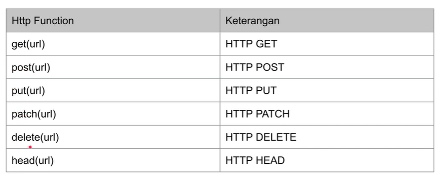
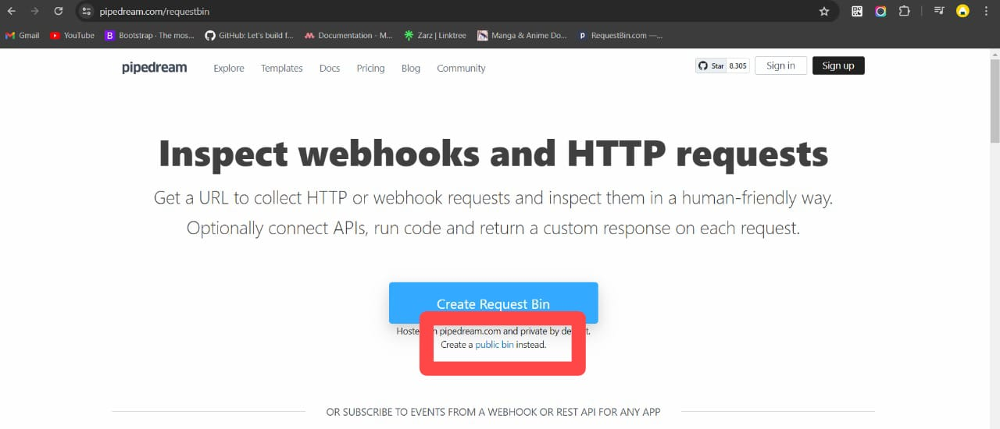
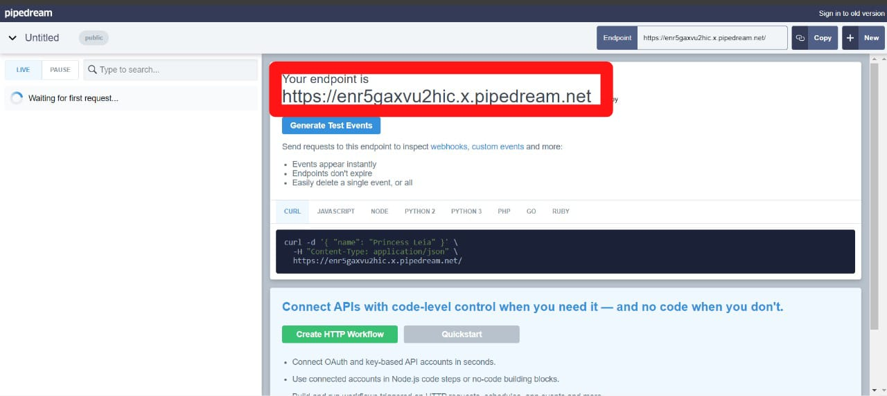
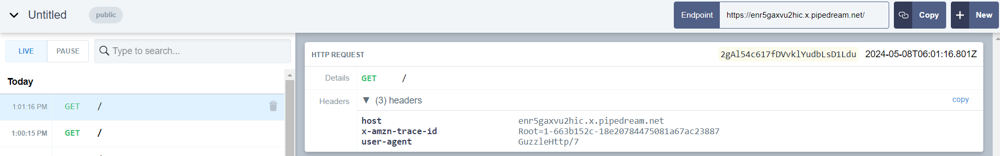
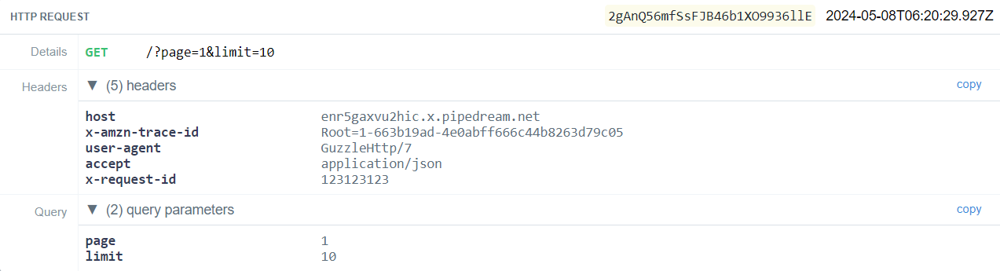
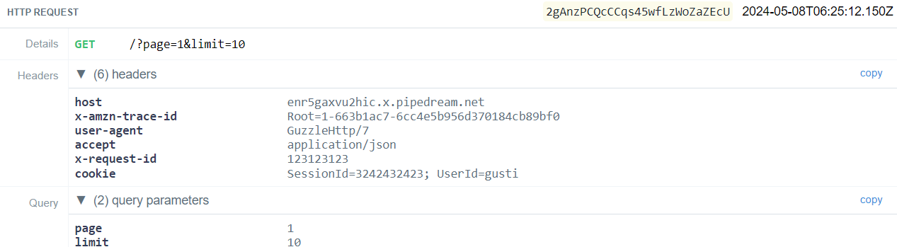
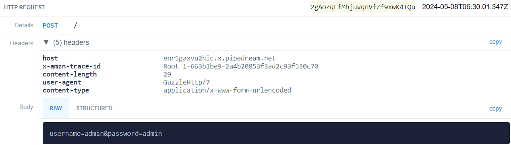
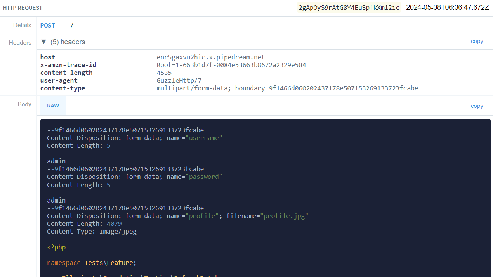
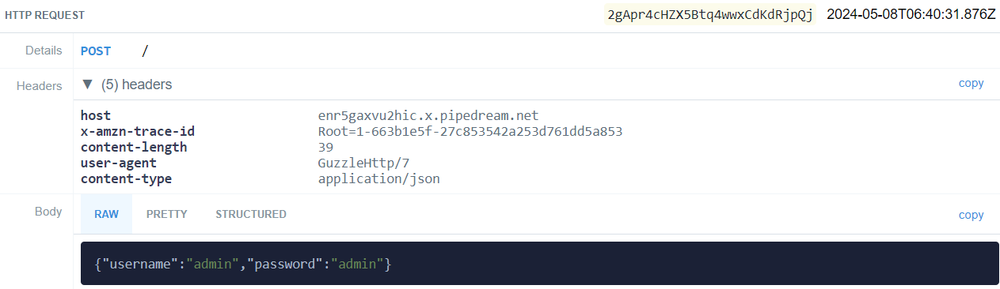

<center>

# BELAJAR LARAVEL HTTP CLIENT

</center>

<center>

## POINT UTAMA

</center>

### 1. Membuat project

-   Minimal versi `PHP` ada versi 8,

-   Dan composer versi 2 atau lebih,

-   Pada cmd gunakan perintah `composer create-project laravel/laravel=v10.2.9 belajar-laravel-http-client`.

---

### 2. HTTP Client

-   Fitur HTTP Client di `Laravel` digunakan untuk melakukan request ke HTTP.

-   `Laravel` menggunakan library `Guzzle` untuk HTTP Client nya.

-   Library yang digunakan `Laravel` untuk request HTTP Client, https://github.com/guzzle/guzzle

---

### 3. HTTP Method

-   Http Facade Function

    

---

### 4. Test HTTP Request

-   Saya akan gunakan sebuah website untuk test HTTP request,

-   link web: https://pipedream.com/requestbin

    

-   Klik `Create a public bin`

-   Lalu secara otomatis akan dibuatkan `endpoint` untuk mengirim http request,

-   Copy link `end point`

    

---

### 5. Unit Test Get, Post & Delete

-   Kode penggunaan `get`

    ```PHP
    public function testGet()
    {
        $response = Http::get("https://enr5gaxvu2hic.x.pipedream.net");
        self::assertTrue($response->ok());
    }
    ```

-   Output

    

-   Selain menggunakan `get` bisa juga menggunakan `post` atau `delete`.

---

### 6. Response

-   Setiap menggunakan function http method di Facade http, maka akan menghasilkan object `response`.

-   Link dokumentasi http response: https://laravel.com/api/10.x/Illuminate/Http/Client/Response.html

-   Kode unit test response

    ```PHP
    public function testResponse()
    {
        $response = Http::get("https://enr5gaxvu2hic.x.pipedream.net");
        self::assertEquals(200, $response->status());
        self::assertNotNull($response->headers());
        self::assertNotNull($response->body());

        $json = $response->json();
        self::assertTrue($json['success']);
    }
    ```

---

### 7. Query Parameter

-   Gunakan function `withQueryParameters(array)` untuk menambahkan query parameter ke request http.

    ```PHP
    public function testQueryParameter()
    {
        $response = Http::withQueryParameters([
            'page' => 1,
            'limit' => 10,
        ])->get("https://enr5gaxvu2hic.x.pipedream.net");
        self::assertTrue($response->ok());
    }
    ```

---

### 8. Header

-   Untuk menambahkan `header` ke request http gunakan function `withHeaders(array)`.

    ```PHP
     public function testHeader()
    {
        $response = Http::withQueryParameters([
            'page' => 1,
            'limit' => 10,
        ])->withHeaders([
            'Accept' => 'application/json',
            'X-Request-ID' => '123123123', // random number
        ])->get("https://enr5gaxvu2hic.x.pipedream.net");
        self::assertTrue($response->ok());
    }
    ```

-   Output

    

---

### 9. Cookie

-   Untuk menambahkan `cookie` ke request http gunakan function `withCookies`.

    ```PHP
    public function testCookie()
    {
        $response = Http::withQueryParameters([
            'page' => 1,
            'limit' => 10,
        ])->withHeaders([
            'Accept' => 'application/json',
            'X-Request-ID' => '123123123',
        ])->withCookies([
            "SessionId" => "3242432423",
            "UserId" => "gusti",
        ], "en9s3i1hxiykr.x.pipedream.net")->get("https://enr5gaxvu2hic.x.pipedream.net");
        self::assertTrue($response->ok());
    }

    ```

-   Output

    

---

### 10. Form Post

-   Gunakan function `asForm()` jika ingin mengirim request http dalam bentuk Form Request,

-   Nanti datanya akan dikirim ketika kita menggunakan function `post(url, form)`.

    ```PHP
    public function testFormPost()
    {
        $response = Http::asForm()->post("https://enr5gaxvu2hic.x.pipedream.net", [
            "username" => "admin",
            "password" => "admin"
        ]);
        self::assertTrue($response->ok());
    }
    ```

-   Output

    

---

### 11. Multipart

-   Bisa digunakan untuk mengupload file, gunakan function `asMultipart()`, maksimal 100 kb di (https://pipedream.com/requestbin)

-   Lalu untuk mengirim file, gunakan function `attach(key, content, name)`,

-   Dan untuk data bukan file, gunakan function `post(url,form)`.

    ```PHP
    public function testMultipart()
    {
        $response = Http::asMultipart()
            ->attach("profile", file_get_contents(__DIR__ . '/HttpTest.php'), "profile.jpg")
            ->post("https://enr5gaxvu2hic.x.pipedream.net", [
                "username" => "admin",
                "password" => "admin"
            ]);
        self::assertTrue($response->ok());
    }
    ```

-   Output

    

---

### 12. JSON

-   Gunakan function `asJson()` untuk mengirim request dalam bentuk JSON,

-   Data JSON bisa dikirim di parameter body milik
    `post(url, body)`, `put(url,body)` atau `patch(url,body)`.

    ```PHP
    public function testJSON()
    {
        $response = Http::asJson()
            ->post("https://enr5gaxvu2hic.x.pipedream.net", [
                "username" => "admin",
                "password" => "admin"
            ]);
        self::assertTrue($response->ok());
        $response->throw();
    }
    ```

-   Output

    

---

### 13. TimeOut

-   Saat melakukan request ada baiknya menentukan waktu timeout, atau waktu menyerah menunggu response sebuah website/aplikasi.

-   Hal ini bertujuan agar website/aplikasi response nya tidak terlalu lambat

-   Gunakan function `timeout(secound)`, untuk menentukan berapa lama waktu timeout nya.

    ```PHP
    public function testTimeout()
    {
        $response = Http::timeout(10)->asJson() //timeout(1) -> error timeout
            ->post("https://enr5gaxvu2hic.x.pipedream.net", [
                "username" => "admin",
                "password" => "admin"
            ]);
        self::assertTrue($response->ok());
    }
    ```

---

### 14. Retry

-   Digunakan untuk meminta http client untuk melakukan `retry`,

-   Ketika menggunakan `retry` maka secara otomatis http request akan mencoba request lagi sejumalah dengan request yang ditentukan.

-   Gunakan function `retry(times, sleep)`

    ```PHP
    public function testRetry()
    {
        $response = Http::timeout(1)->retry(5, 1000)->asJson() //Http::timeout(10)->retry(5, 1000)
            ->post("https://enr5gaxvu2hic.x.pipedream.net", [
                "username" => "admin",
                "password" => "admin"
            ]);
        self::assertTrue($response->ok());
    }
    ```

---

### 15. ThrowError

-   Di Laravel, `throw error` biasanya digunakan untuk melempar pengecualian (exception),

-   Ketika mendapatkan response status code bukan `2xx`, dia tidak akan `throw error`,

-   Jika error akan mengembalikan error requestException.

    ```PHP
    public function testThrowError()
    {
        $this->assertThrows(function () {
            $response = Http::get("https://github.com/HOFii/not-found");
            self::assertEquals(404, $response->status());
            $response->throw();
        }, RequestException::class);
    }
    ```
